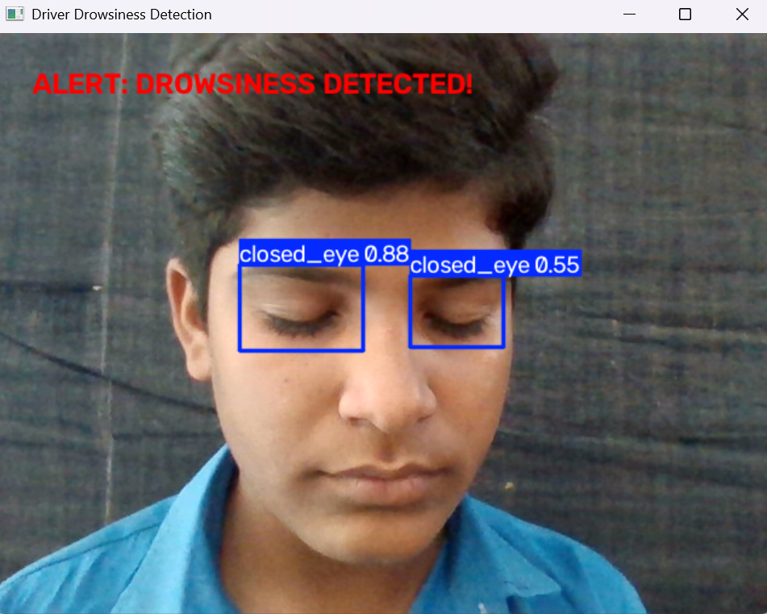

# Driver Drowsiness Detection System

Real-time Driver Drowsiness Detection System that watches a live webcam feed and catches dangerous eye closures before they become accidents. Powered by a fine-tuned YOLOv8n model trained on an eye-state dataset, it fires instant visual + audio alerts when eyes stay shut for 6+ seconds — turning simple computer vision into real road safety.

## Features

- Real-time eye-state detection (open/closed) using a live webcam feed
- Fine-tuned YOLOv8n model trained on a custom eye-state dataset
- Continuous eye-closure tracking with a 6-second alert threshold
- On-screen visual warning banner + audio alarm when drowsiness is detected

## Tech Stack

- **Python**
- **YOLOv8n (Ultralytics)** — object detection model, fine-tuned for eye-state classification
- **OpenCV** — webcam access, real-time video processing, and display

## How It Works

1. The webcam captures live video frames.
2. Each frame is passed through the fine-tuned YOLOv8n model, which detects whether the eyes are open or closed.
3. If the eyes are detected as closed continuously for 6 or more seconds, the system triggers:
   - A red on-screen warning banner
   - An audio alarm

## Model Training

The model was fine-tuned from a pretrained YOLOv8n checkpoint on a custom eye-state dataset (open/closed eyes: 846 images), using transfer learning in Google Colab with a T4 GPU. Dataset preparation, class cleanup, and fine-tuning are documented in `training_notebook.ipynb`.

**Test Dataset Performance:**

| Metric | Value |
|--------|-------|
| Precision | 72.85% |
| Recall | 70.83% |
| mAP@50 | 69.70% |
| mAP@50-95 | 38.95% |

## Project Structure

Driver-Drowsiness-Detection/
├── drowsiness_app.py # Main application — real-time detection + alerts
├── best.pt # Fine-tuned YOLOv8n model weights
├── training_notebook.ipynb # Model training process (Colab)
├── requirements.txt # Python dependencies
├── images/
│ └── demo.png # Demo screenshot
└── README.md

## Running the Project

1. Clone this repository:

git clone https://github.com/Nokhiz-Khan/Driver-Drowsiness-Detection.git
cd Driver-Drowsiness-Detection

2. Install dependencies:

pip install -r requirements.txt

3. Run the app:

python drowsiness_app.py

4. Press `q` to quit the application.
